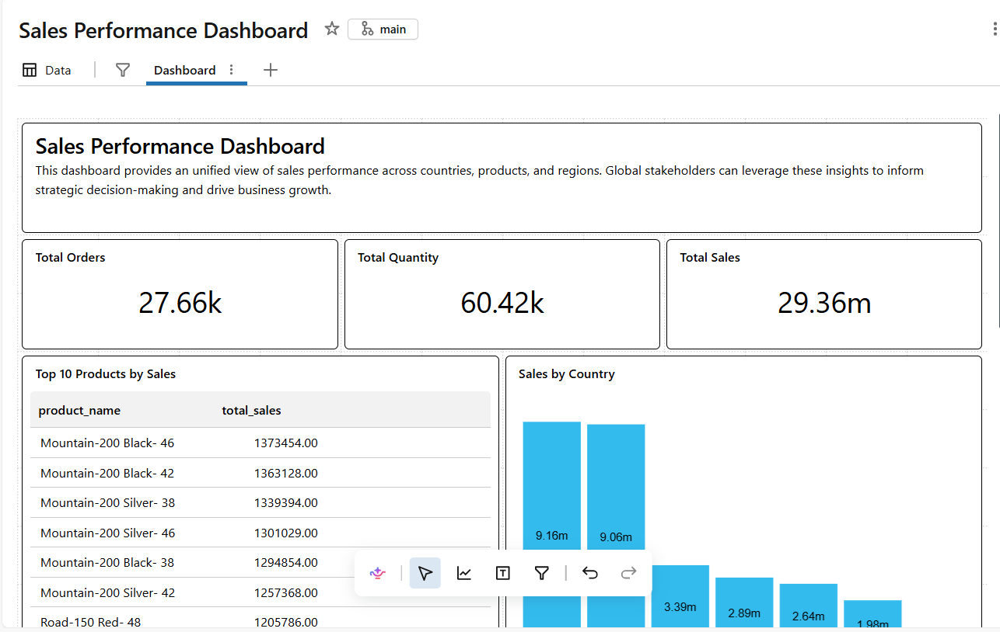

# Building an End-to-End Medallion Architecture

This project implements a data lakehouse using Medallion Architecture (bronze, silver, gold data layers) to optimize ELT for order transactions, build analytics-ready tables, and an interactive dashboard. It leverages Databricks features to build the end-to-end architecture and dashboard.

## Source Data

| Table Name | Description |
|------------|-------------|
| `cust_info` | Customer master details |
| `prd_info` | Product master details |
| `sales_details` | Order transaction records |
| `cust_az12` | Additional customer dataset |
| `loc_a101` | Customer location information |
| `px_cat_g1v2` | Product category details |

---

# Methodology

## 🔗 Source Data Ingestion

- Created a Databricks catalog and uploaded source `.csv` files from local storage
- Ingested six source datasets consisting of customer, product, category, location, and sales transaction data
- Stored raw files in Databricks Volume storage for ingestion and processing
- Designed the initial data model by identifying relationships and key mappings across datasets

---

## 🟤 Bronze Layer — Raw Data Ingestion

- Created the `bronze` schema to store raw ingested data
- Loaded source `.csv` files into Bronze tables using full-load ingestion
- Preserved raw data structure with minimal transformations
- Included datasets for:
  - Customers
  - Products
  - Categories
  - Locations
  - Sales transactions

---

## ⚪ Silver Layer — Data Cleansing & Standardization

- Created the `silver` schema for cleaned and standardized datasets
- Applied data quality transformations including:
  - Handling null and invalid values
  - Standardizing date formats
  - Trimming leading and trailing spaces
  - Normalizing data formats
- Added `dwh_create_date` to track transformation and load timestamps
- Built curated Silver tables optimized for analytical processing

---

## 🟡 Gold Layer — Dimensional Modeling

- Created business-ready analytical tables in the `gold` schema
- Unified customer-related datasets into a consolidated customer dimension table
- Combined product and category datasets into a product dimension table
- Added surrogate keys to dimension tables for efficient joins and warehouse modeling
- Built a centralized fact table by joining sales transactions with dimension tables
- Designed the Gold layer using a star schema approach to support BI and reporting workloads

---

## 📊 BI Dashboard

- Developed a sales analysis dashboard using Databricks SQL
- Created visualizations and KPI metrics including:
  - Total Sales
  - Total Orders
  - Top-Selling Products
  - Yearly Quantity Trends

